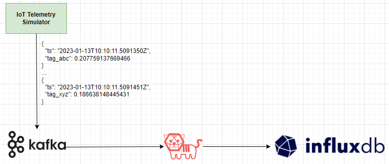

# iot-simulator-influxdb
This repo demonstrates how to simulate synthetic IoT telemetry and ingest it into [InfluxDB OSS](https://docs.influxdata.com/influxdb/v2.6/). The telemetry is generated using the [Azure IoT Device Telemetry Simulator](https://github.com/Azure-Samples/Iot-Telemetry-Simulator). The Simulator is capable of sending data to a [Confluent Community Kafka](https://docs.confluent.io/kafka/introduction.html) broker. [Telegraf](https://docs.influxdata.com/telegraf/v1.26/) is then used to consume the telemetry from Kafka and ingest it into InfluxDB. The entire flow is orchestrated using [Docker Compose](https://docs.docker.com/compose/).

<div align="center">
    
</div>

## Steps
- `docker compose up`
- Wait for the containers to be up and running and for log messages to confirm that telemetry is being sent.
- Open http://localhost:8086 in the browser and login with the InfluxDB credentials specified in thhe `.env` file.
- In the Influx Query Editor, try the following [Flux query](https://docs.influxdata.com/influxdb/v2.6/query-data/get-started/query-influxdb/) to visualize the raw data.
```
from(bucket: "ts-bucket") 
    |> range(start: -15m)
```

## Configuration
- All credentials are stored in the `.env` file.
- To modify the telemetry payload, the env vars `Template` and `Variables` under the `iot-telemetry-simulator` service in `docker-compose.yml` can be used.
- To configure the [JSON parsing](https://docs.influxdata.com/telegraf/v1.26/data_formats/input/json/) and Influx DB measurements, please modify `telegraf.conf` accordingly. A reference Telegraf config has been provided in `default-telegraf.conf`.
